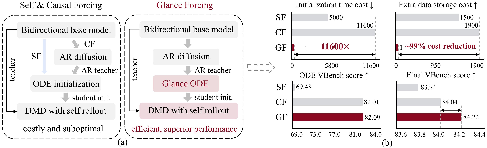

# Glance Forcing: One Sample Forcing Model

Official PyTorch implementation of the paper:

**Glance Forcing: Making Bidirectional Diffusion Autoregressive at a Glance**
<br>
<!-- In ECCV 2026 -->
<!-- <br> -->
[Zhuobai Dong](https://zhuobaidong.github.io/)<sup>1</sup>, 
[Junchao Yi](https://github.com/Junc1i)<sup>2</sup>,
[Hu Jian Guo](https://ieeexplore.ieee.org/author/37536384400)<sup>3</sup>,
[Linjie Li](https://scholar.google.com/citations?user=WR875gYAAAAJ&hl=en)<sup>4</sup>,
[Alex Jinpeng Wang](https://fingerrec.github.io/)<sup>5</sup>
[Rui Zhao](https://ruizhaocv.github.io/)<sup>6</sup>
<br>
<sup>1</sup>WuHan University, <sup>2</sup>University of Electronic Science and Technology of China, <sup>3</sup>Sun Yat-sen University, <sup>4</sup>University of Washington, <sup>5</sup>Central South University, <sup>6</sup>National University of Singapore
<br>
[ArXiv](https://arxiv.org/abs/2512.02899) | [Homepage](https://zhuobaidong.github.io/Glance/) | [Model🤗](https://huggingface.co/CSU-JPG/Glance) | [Demo](https://348d29f48ab953c1e8.gradio.live/)



### Installation
```bash
conda create -n causal_forcing python=3.10 -y
conda activate causal_forcing
pip install -r requirements.txt
pip install git+https://github.com/openai/CLIP.git
pip install flash-attn --no-build-isolation
python setup.py develop
```
### Download Checkpoints
```bash
hf download Wan-AI/Wan2.1-T2V-1.3B  --local-dir wan_models/Wan2.1-T2V-1.3B
hf download Wan-AI/Wan2.1-T2V-14B  --local-dir wan_models/Wan2.1-T2V-14B
# base model
hf download zhuhz22/Causal-Forcing chunkwise/ar_diffusion.pt --local-dir checkpoints
# dataset
hf download gdhe17/Self-Forcing vidprom_filtered_extended.txt --local-dir prompts
# slow lora and fast lora
wget https://huggingface.co/zhuobai/Glance-Forcing/resolve/main/fast_lora.pt
wget https://huggingface.co/zhuobai/Glance-Forcing/resolve/main/slow_lora.pt
```

### 💡 如果下载速度较慢，可以试试下面这个镜像站
```bash
export HF_ENDPOINT=https://hf-mirror.com
```

### Training

首先把 trainer/distillation_lora.py 的 103 行附件换成真实的 lora 本地路径，然后运行下面的指令:

```bash
torchrun --nnodes=1 --nproc_per_node=8 --rdzv_id=5235 \
  --rdzv_backend=c10d \
  --rdzv_endpoint localhost:29503 \
  train.py \
  --config_path configs/causal_forcing_dmd_chunkwise.yaml \
  --logdir logs/causal_forcing_dmd_chunkwise
```

### Inference （for yilin）
把训练好的两个lora 路径换下即可
```bash
python infer_glance.py \
  --config_path configs/causal_forcing_dmd_chunkwise.yaml \
  --output_folder output/dmd \
  --checkpoint_path checkpoints/chunkwise/ar_diffusion.pt \
  --lora_path_1 checkpoints/dmd/slow_lora.pt \
  --lora_path_2 checkpoints/dmd/fast_lora.pt \
  --data_path prompts/demos.txt \
  --steps 4
```

### Inference （for 俊超）
#### 3k data training ode model evaluation
```bash
hf download zhuobai/Glance-Forcing 3k_sample_ode/slow_lora.pt --local-dir checkpoints
hf download zhuobai/Glance-Forcing 3k_sample_ode/fast_lora.pt --local-dir checkpoints
```
```bash
python infer_glance.py \
  --config_path configs/causal_forcing_dmd_chunkwise.yaml \
  --output_folder output/3k_sample_ode \
  --checkpoint_path checkpoints/chunkwise/ar_diffusion.pt \
  --lora_path_1 checkpoints/3k_sample_ode/slow_lora.pt \
  --lora_path_2 checkpoints/3k_sample_ode/fast_lora.pt \
  --data_path prompts/demos.txt \
  --steps 4
```
#### 1 data training ode model evaluation
```bash
hf download zhuobai/Glance-Forcing one_sample_ode/slow_lora.pt --local-dir checkpoints
hf download zhuobai/Glance-Forcing one_sample_ode/fast_lora.pt --local-dir checkpoints
```
```bash
python infer_glance.py \
  --config_path configs/causal_forcing_dmd_chunkwise.yaml \
  --output_folder output/one_sample_ode \
  --checkpoint_path checkpoints/chunkwise/ar_diffusion.pt \
  --lora_path_1 checkpoints/one_sample_ode/slow_lora.pt \
  --lora_path_2 checkpoints/one_sample_ode/fast_lora.pt \
  --data_path prompts/demos.txt \
  --steps 4
```
#### 1 data training dmd model evaluation
```bash
hf download zhuobai/Glance-Forcing one_sample_dmd/slow_lora.pt --local-dir checkpoints
hf download zhuobai/Glance-Forcing one_sample_dmd/fast_lora.pt --local-dir checkpoints
```
```bash
python infer_glance.py \
  --config_path configs/causal_forcing_dmd_chunkwise.yaml \
  --output_folder output/one_sample_ode \
  --checkpoint_path checkpoints/chunkwise/ar_diffusion.pt \
  --lora_path_1 checkpoints/one_sample_dmd/slow_lora.pt \
  --lora_path_2 checkpoints/one_sample_dmd/fast_lora.pt \
  --data_path prompts/demos.txt \
  --steps 4
```
